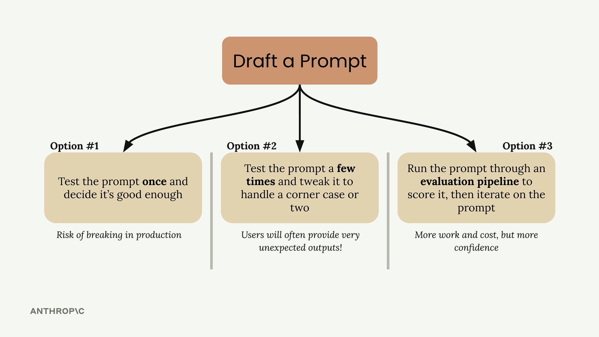
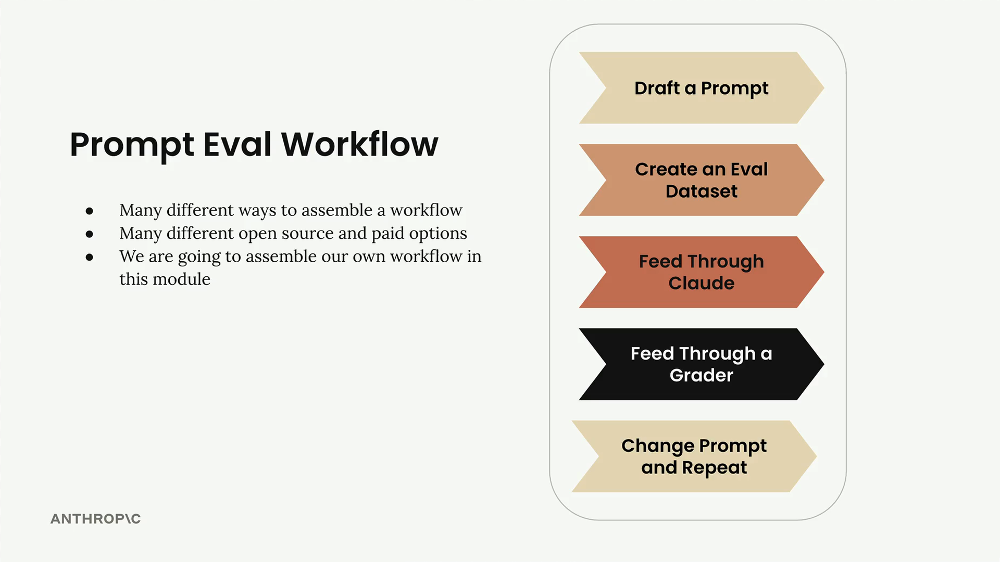
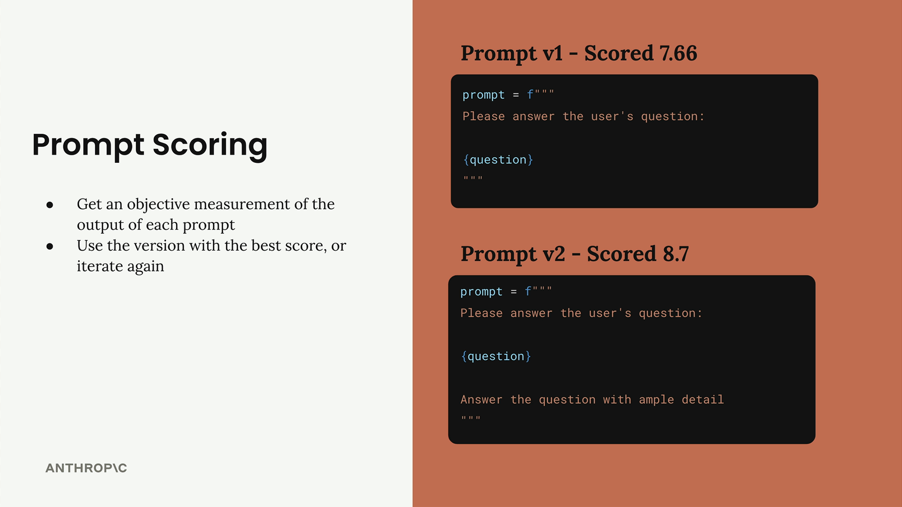
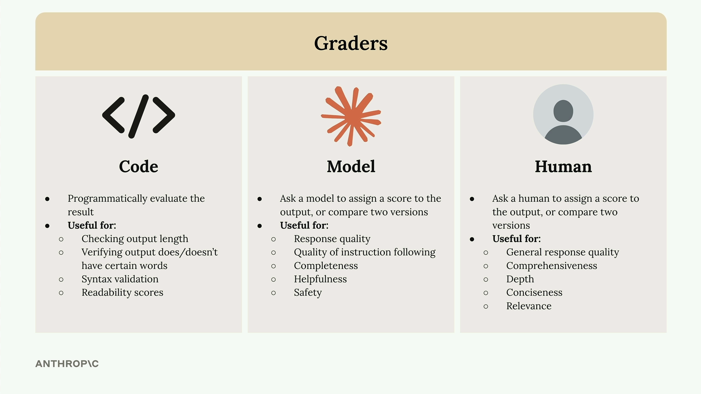
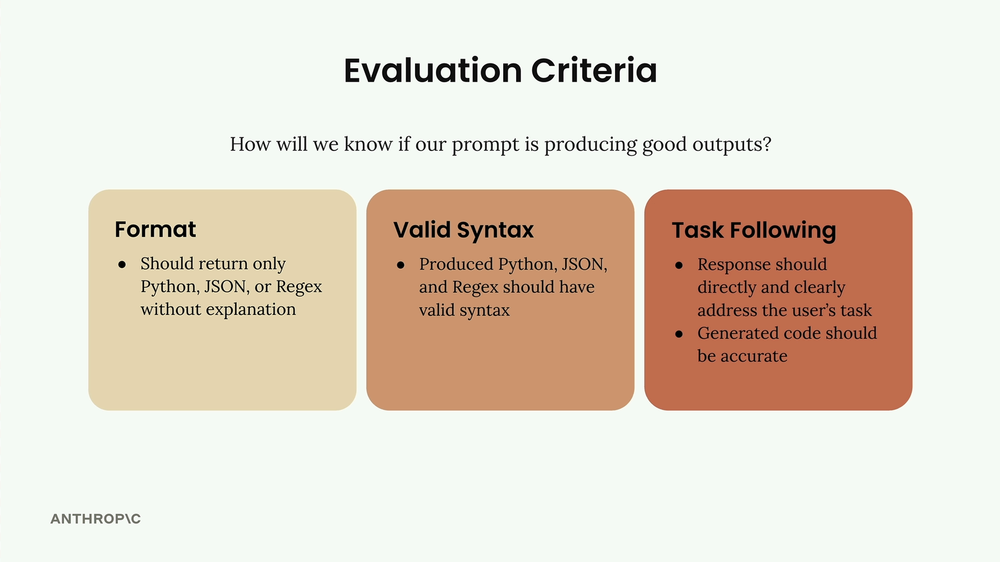

# Prompt Evaluation

Three Paths After Writing a Prompt

Once you've drafted a prompt, you typically face three options for what to do next:

Option 1: Test the prompt once and decide it's good enough. This carries a significant risk of breaking in production when users provide unexpected inputs.

Option 2: Test the prompt a few times and tweak it to handle a corner case or two. While better than option 1, users will often provide very unexpected outputs that you haven't considered.

Option 3: Run the prompt through an evaluation pipeline to score it, then iterate on the prompt based on objective metrics. This approach requires more work and cost, but gives you much more confidence in your prompt's reliability.

## The Evaluation-First Approach

**Option 3** represents a more systematic approach to prompt development. By running your prompt through an evaluation pipeline, you get objective metrics about its performance across a broader range of test cases. This data-driven approach lets you:

* Identify weaknesses before they become production issues
* Compare different prompt versions objectively
* Iterate with confidence based on measurable improvements
* Build more reliable AI applications

While this approach requires more upfront investment in time and testing infrastructure, it pays dividends in the reliability and robustness of your final application. The goal is to catch problems during development rather than after your users encounter them.

A typical prompt evaluation workflow follows five key steps that help you systematically improve your prompts through objective measurement. While there are many different ways to assemble these workflows and various open source and paid tools available, understanding the core process helps you start small and scale up as needed.

## Prompt Scoring

The key benefit of this workflow is getting objective measurements of prompt performance. You can:

* Compare different prompt versions numerically
* Use the version with the best score
* Continue iterating to find even better approaches

## Graders

