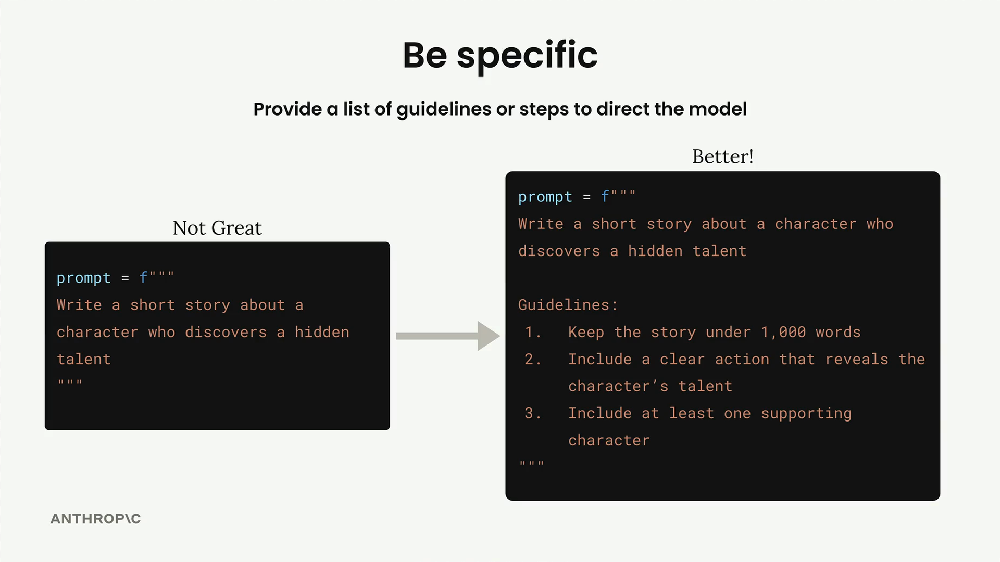
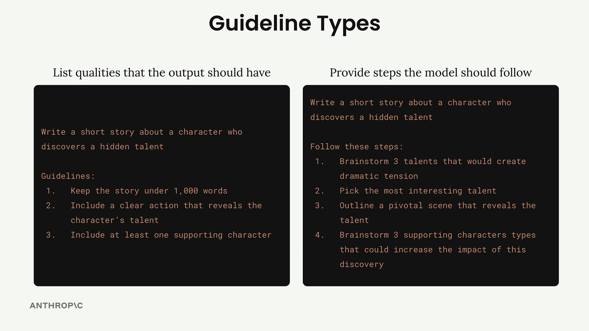
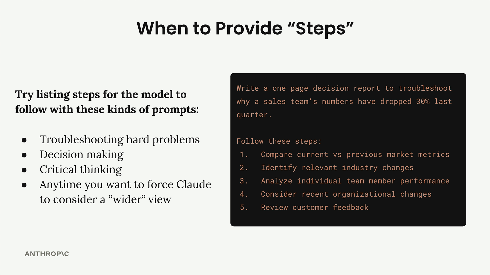
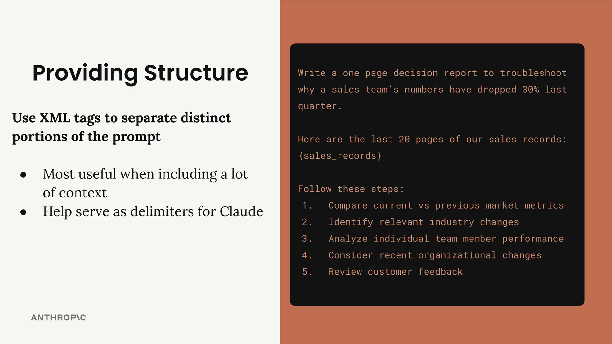
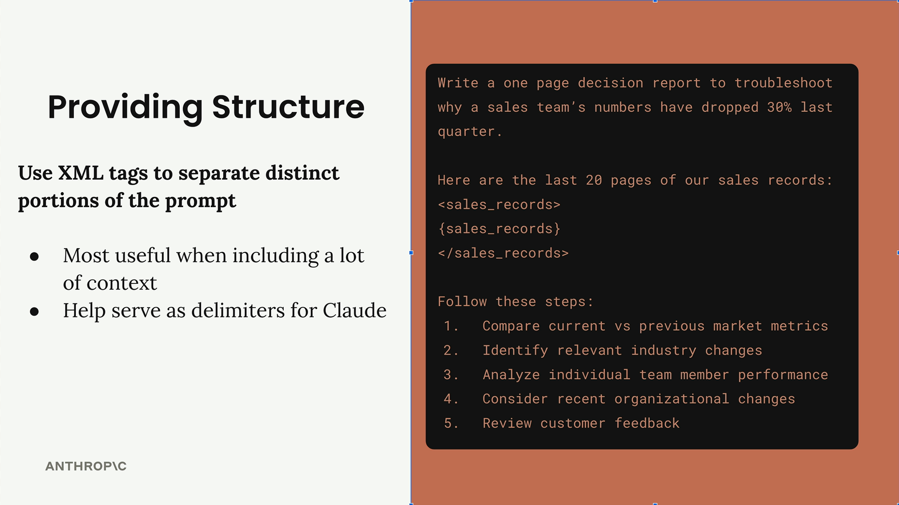
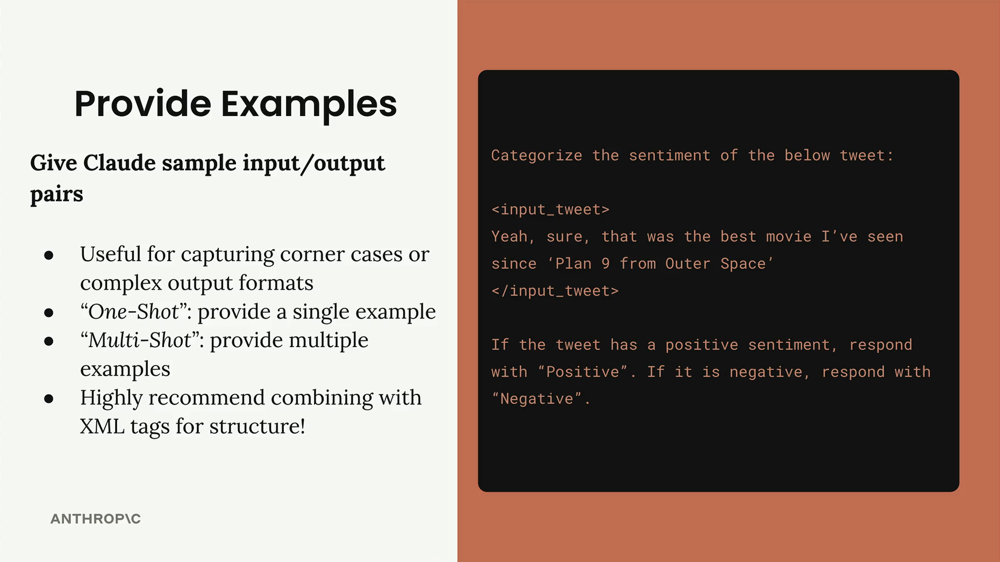
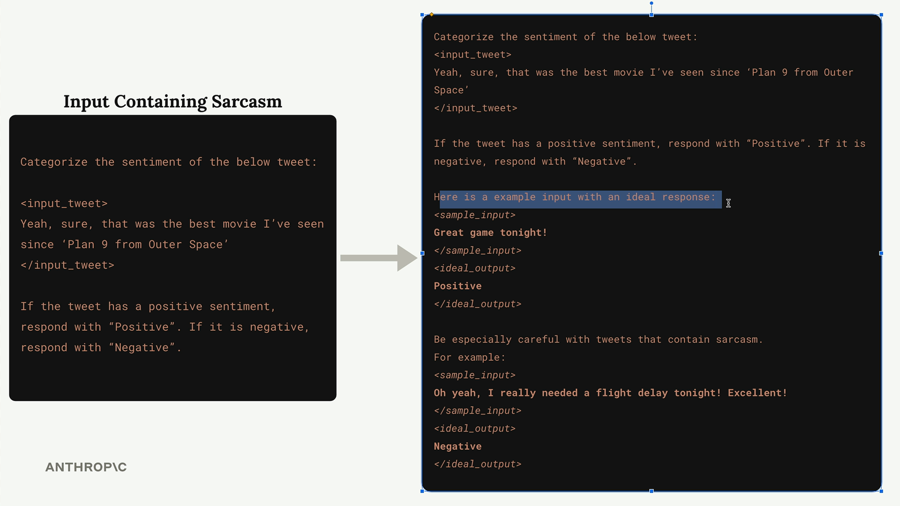
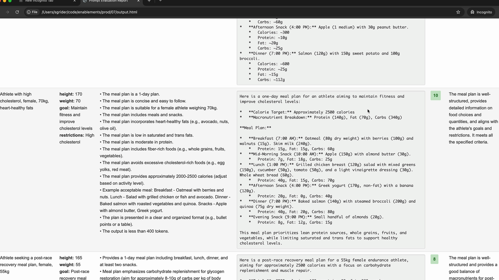

# Prompt Engineering

Prompt engineering is about taking a prompt you've written and improving it to get more reliable, higher-quality outputs. This process involves iterative refinement - starting with a basic prompt, evaluating its performance, then systematically applying engineering techniques to improve it.


## The Iterative Improvement Process

The approach follows a clear cycle that you can repeat until you achieve your desired results:


1. Set a goal - Define what you want your prompt to accomplish
2. Write an initial prompt - Create a basic first attempt
3. Evaluate the prompt - Test it against your criteria
4. Apply prompt engineering techniques - Use specific methods to improve performance
5. Re-evaluate - Verify that your changes actually improved the results

You repeat the last two steps until you're satisfied with the performance. Each iteration should show measurable improvement in your evaluation scores.

## Setting Up Your Evaluation Pipeline

To demonstrate this process, we'll work with a practical example: creating a prompt that generates one-day meal plans for athletes. The prompt needs to take into account an athlete's height, weight, goals, and dietary restrictions, then produce a comprehensive meal plan.


The evaluation setup uses a PromptEvaluator class that handles dataset generation and model grading. When creating your evaluator instance, you can control concurrency with the max_concurrent_tasks parameter:

```
evaluator = PromptEvaluator(max_concurrent_tasks=5)
```

Start with a low concurrency value (like 3) to avoid rate limit errors. You can increase it if your API quota allows for faster processing.

## Generating Test Data

The evaluation system can automatically generate test cases based on your prompt requirements. You define what inputs your prompt needs:

```
dataset = evaluator.generate_dataset(
    task_description="Write a compact, concise 1 day meal plan for a single athlete",
    prompt_inputs_spec={
        "height": "Athlete's height in cm",
        "weight": "Athlete's weight in kg", 
        "goal": "Goal of the athlete",
        "restrictions": "Dietary restrictions of the athlete"
    },
    output_file="dataset.json",
    num_cases=3
)
```

Keep the number of test cases low (2-3) during development to speed up your iteration cycle. You can increase this for final validation.

## Writing Your Initial Prompt

Start with a simple, naive prompt to establish a baseline. Here's an example of a deliberately basic first attempt:

```
def run_prompt(prompt_inputs):
    prompt = f"""
What should this person eat?

- Height: {prompt_inputs["height"]}
- Weight: {prompt_inputs["weight"]}
- Goal: {prompt_inputs["goal"]}
- Dietary restrictions: {prompt_inputs["restrictions"]}
"""
    
    messages = []
    add_user_message(messages, prompt)
    return chat(messages)
```

This basic prompt will likely produce poor results, but it gives you a starting point to measure improvement against.

## Adding Evaluation Criteria

When running your evaluation, you can specify additional criteria that the grading model should consider:

```
results = evaluator.run_evaluation(
    run_prompt_function=run_prompt,
    dataset_file="dataset.json",
    extra_criteria="""
The output should include:
- Daily caloric total
- Macronutrient breakdown  
- Meals with exact foods, portions, and timing
"""
)
```

This helps ensure your prompt is evaluated against the specific requirements that matter for your use case.

## Analyzing Results

After running an evaluation, you'll get both a numerical score and a detailed HTML report. The report shows you exactly how each test case performed, including the model's reasoning for each score.


Don't be discouraged by low initial scores - a score of 2.3 out of 10 is typical for a first attempt. The goal is to see consistent improvement as you apply engineering techniques.


The detailed evaluation report helps you understand exactly where your prompt is failing and what improvements are needed. Use this feedback to guide your next iteration.

# Being clear and direct

The first line of your prompt is the most important part of your entire request. This is where you set the stage for everything that follows, and getting it right can dramatically improve your results.
Being Clear and Direct

When crafting that crucial first line, you want to focus on two key principles: clarity and directness. This means using simple language that leaves no room for ambiguity about what you want Claude to do.


## Clear Communication

Being "clear" means:

    Use simple language that anyone can understand
    State exactly what you want without beating around the bush
    Lead with a straightforward statement of Claude's task

Instead of writing something vague like "I need to know about those things people put on their roofs that use sun - those solar panel things, I think they're called," be direct and write: "Write three paragraphs about how solar panels work."

## Direct Instructions

Being "direct" focuses on how you structure your request:

    Use instructions, not questions
    Start with direct action verbs like "Write," "Create," or "Generate"

Rather than asking "I was reading about renewable energy and geothermal energy sounds neat. What countries use it?" try: "Identify three countries that use geothermal energy. Include generation stats for each."

## Putting It Into Practice

Let's see this technique in action. Starting with a weak prompt that simply asked "What should this person eat?" we can apply our clear and direct approach.

The improved version becomes: Generate a one-day meal plan for an athlete that meets their dietary restrictions.

This revision immediately tells Claude:

    What action to take (generate)
    What to create (a meal plan)
    Key constraints (one day, for an athlete, meeting dietary restrictions)

## Results Matter

This simple change can have a significant impact on performance. In our example, the evaluation score jumped from 2.32 to 3.92 - a substantial improvement from just restructuring that opening line.

The key takeaway is that Claude responds best when you treat it like a capable assistant who needs clear direction rather than someone who has to guess what you want. Start strong with a direct action verb, be specific about the task, and you'll see better results right away.

# Being specific



Two Types of Guidelines

There are two main approaches to being specific in your prompts, and you'll often see them used together in professional applications.



## Output Quality Guidelines

The first type focuses on listing qualities that your output should have. These guidelines help you control:

    Length of the response
    Structure and format
    Specific attributes or elements to include
    Tone or style requirements

For example, you might specify that a story should be under 1,000 words, include a clear action that reveals the character's talent, and feature at least one supporting character.

## Process Steps

The second type provides specific steps for Claude to follow. This approach is particularly useful when you want Claude to think through a problem systematically or consider multiple perspectives before arriving at a final answer.

Instead of jumping straight to writing, you might ask Claude to:

    Brainstorm three talents that would create dramatic tension
    Pick the most interesting talent
    Outline a pivotal scene that reveals the talent
    Brainstorm supporting character types that could increase the impact

## Real-World Impact

The difference that specificity makes is dramatic. In testing a meal planning prompt, adding guidelines improved the evaluation score from 3.92 to 7.86 - more than doubling the quality of the output simply by telling Claude exactly what elements to include.

Guidelines:
1. Include accurate daily calorie amount
2. Show protein, fat, and carb amounts  
3. Specify when to eat each meal
4. Use only foods that fit restrictions
5. List all portion sizes in grams
6. Keep budget-friendly if mentioned

## When to Use Each Approach

Here's a practical guide for when to use each type of specificity:
Always Use Output Guidelines

You should include quality guidelines in almost every prompt you write. They're your safety net for getting consistent, useful results.
Use Process Steps For Complex Problems

Add step-by-step instructions when you're dealing with:

    Troubleshooting complex problems
    Decision-making scenarios
    Critical thinking tasks
    Any situation where you want Claude to consider multiple angles



# Structure with XML tags

When you're building prompts that include a lot of content, Claude can sometimes struggle to understand which pieces of text belong together or what different sections are supposed to represent. XML tags provide a simple way to add structure and clarity to your prompts, especially when you're interpolating large amounts of data.

## Why Structure Matters

Consider a prompt where you need to analyze 20 pages of sales records. Without clear boundaries, Claude might have trouble distinguishing between your instructions and the actual data you want analyzed.



then 



## When to Use XML Tags

XML tags are most useful when:

    Including large amounts of context or data
    Mixing different types of content (code, documentation, data)
    You want to be extra clear about content boundaries
    Working with complex prompts that interpolate multiple variables

Even for shorter content, XML tags can help serve as delimiters that make your prompt structure more obvious to Claude.

## Real-World Application

In practice, you might structure a prompt like this:

```
<athlete_information>
- Height: 6'2"
- Weight: 180 lbs
- Goal: Build muscle
- Dietary restrictions: Vegetarian
</athlete_information>
```

Generate a meal plan based on the athlete information above.

This makes it crystal clear that the height, weight, goal, and restrictions are all related athlete data that should be considered together when generating the meal plan.

While you might not see dramatic improvements with simple prompts, XML tags become increasingly valuable as your prompts grow more complex and include larger amounts of varied content.

# Providing examples

## How Examples Work

Let's look at a sentiment analysis example. Say you want Claude to categorize whether a tweet is positive or negative:



The challenge here is sarcasm. A tweet like "Yeah, sure, that was the best movie I've seen since 'Plan 9 from Outer Space'" appears positive on the surface, but it's actually sarcastic and negative (Plan 9 is famously one of the worst movies ever made).

## Adding Examples to Handle Corner Cases

To solve this, you can add examples that show Claude how to handle tricky 



The improved prompt includes:

    A clear positive example: "Great game tonight!" → "Positive"
    A sarcastic example: "Oh yeah, I really needed a flight delay tonight! Excellent!" → "Negative"
    Context explaining why sarcasm should be treated carefully

Notice how the examples are wrapped in XML tags like <sample_input> and <ideal_output>. This structure makes it crystal clear to Claude what each part represents.

## When to Use Examples

Examples are particularly useful for:

    Capturing corner cases or edge scenarios
    Defining complex output formats (like specific JSON structures)
    Showing the exact style or tone you want
    Demonstrating how to handle ambiguous inputs

## One-Shot vs Multi-Shot

**One-Shot**: Provide a single example to establish the pattern

**Multi-Shot**: Provide multiple examples to cover different scenarios

Use multi-shot when you need to handle various edge cases or want to show different types of valid responses.

## Finding Good Examples from Evaluations

When running prompt evaluations, look for your highest-scoring outputs to use as examples:




## Adding Context to Examples

Don't just provide the input/output pair - explain why the output is good:

```
<ideal_output>
[Your example output here]
</ideal_output>

This example is well-structured, provides detailed information 
on food choices and quantities, and aligns with the athlete's 
goals and restrictions.
```

This additional context helps Claude understand the reasoning behind good responses, not just the format.


## Best Practices

* Always use XML tags to structure your examples clearly
* Be explicit about what you're showing: "Here is an example input with an ideal response"
* Include examples that address your most common failure cases
* Explain why your example outputs are considered ideal
* Keep examples relevant to your specific task

Examples are especially powerful because they show rather than tell. Instead of trying to describe exactly what you want in words, you demonstrate it directly. This makes your prompts much more reliable and helps Claude understand subtle requirements that might be hard to express in instructions alone.
