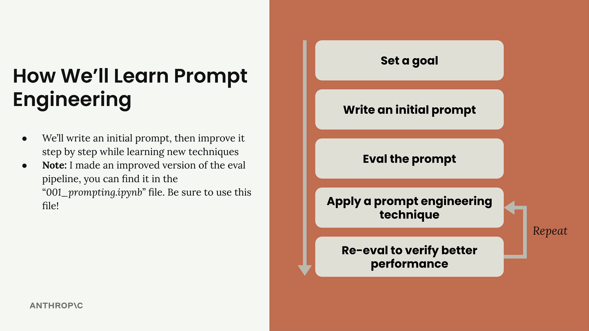
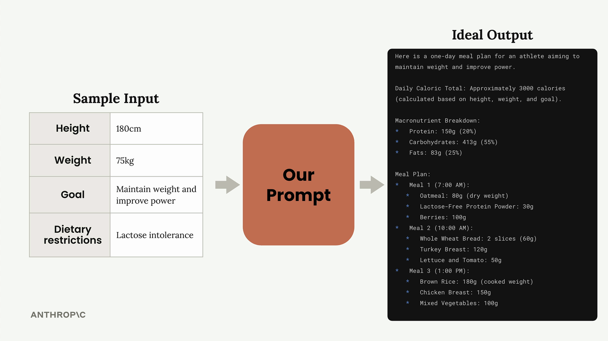
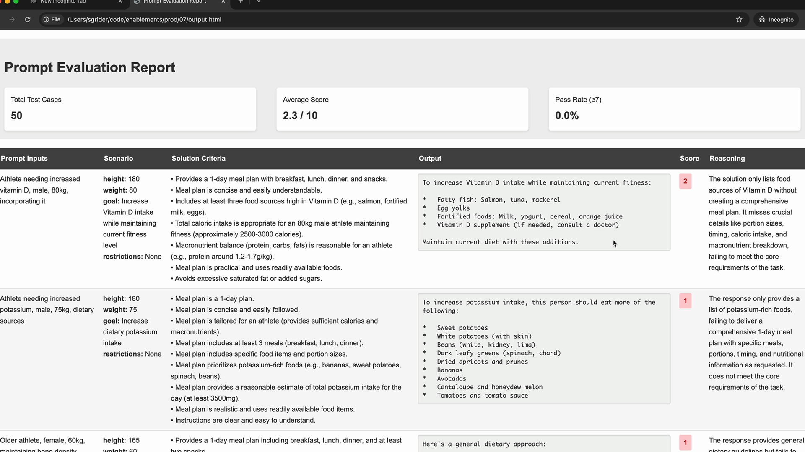
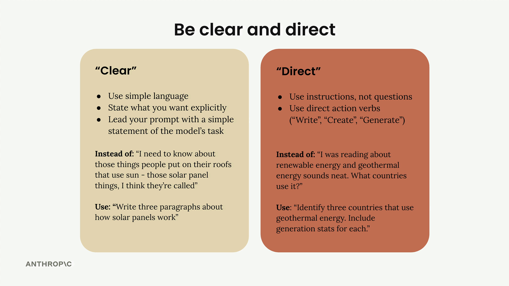

# Prompt Engineering

Prompt engineering is about taking a prompt you've written and improving it to get more reliable, higher-quality outputs. This process involves iterative refinement - starting with a basic prompt, evaluating its performance, then systematically applying engineering techniques to improve it.


## The Iterative Improvement Process

The approach follows a clear cycle that you can repeat until you achieve your desired results:




1. Set a goal - Define what you want your prompt to accomplish
2. Write an initial prompt - Create a basic first attempt
3. Evaluate the prompt - Test it against your criteria
4. Apply prompt engineering techniques - Use specific methods to improve performance
5. Re-evaluate - Verify that your changes actually improved the results

You repeat the last two steps until you're satisfied with the performance. Each iteration should show measurable improvement in your evaluation scores.

## Setting Up Your Evaluation Pipeline

To demonstrate this process, we'll work with a practical example: creating a prompt that generates one-day meal plans for athletes. The prompt needs to take into account an athlete's height, weight, goals, and dietary restrictions, then produce a comprehensive meal plan.



The evaluation setup uses a PromptEvaluator class that handles dataset generation and model grading. When creating your evaluator instance, you can control concurrency with the max_concurrent_tasks parameter:

```
evaluator = PromptEvaluator(max_concurrent_tasks=5)
```

Start with a low concurrency value (like 3) to avoid rate limit errors. You can increase it if your API quota allows for faster processing.

## Generating Test Data

The evaluation system can automatically generate test cases based on your prompt requirements. You define what inputs your prompt needs:

```
dataset = evaluator.generate_dataset(
    task_description="Write a compact, concise 1 day meal plan for a single athlete",
    prompt_inputs_spec={
        "height": "Athlete's height in cm",
        "weight": "Athlete's weight in kg", 
        "goal": "Goal of the athlete",
        "restrictions": "Dietary restrictions of the athlete"
    },
    output_file="dataset.json",
    num_cases=3
)
```

Keep the number of test cases low (2-3) during development to speed up your iteration cycle. You can increase this for final validation.

## Writing Your Initial Prompt

Start with a simple, naive prompt to establish a baseline. Here's an example of a deliberately basic first attempt:

```
def run_prompt(prompt_inputs):
    prompt = f"""
What should this person eat?

- Height: {prompt_inputs["height"]}
- Weight: {prompt_inputs["weight"]}
- Goal: {prompt_inputs["goal"]}
- Dietary restrictions: {prompt_inputs["restrictions"]}
"""
    
    messages = []
    add_user_message(messages, prompt)
    return chat(messages)
```

This basic prompt will likely produce poor results, but it gives you a starting point to measure improvement against.

## Adding Evaluation Criteria

When running your evaluation, you can specify additional criteria that the grading model should consider:

```
results = evaluator.run_evaluation(
    run_prompt_function=run_prompt,
    dataset_file="dataset.json",
    extra_criteria="""
The output should include:
- Daily caloric total
- Macronutrient breakdown  
- Meals with exact foods, portions, and timing
"""
)
```

This helps ensure your prompt is evaluated against the specific requirements that matter for your use case.

## Analyzing Results

After running an evaluation, you'll get both a numerical score and a detailed HTML report. The report shows you exactly how each test case performed, including the model's reasoning for each score.


Don't be discouraged by low initial scores - a score of 2.3 out of 10 is typical for a first attempt. The goal is to see consistent improvement as you apply engineering techniques.



The detailed evaluation report helps you understand exactly where your prompt is failing and what improvements are needed. Use this feedback to guide your next iteration.

## Being clear and direct

The first line of your prompt is the most important part of your entire request. This is where you set the stage for everything that follows, and getting it right can dramatically improve your results.
Being Clear and Direct

When crafting that crucial first line, you want to focus on two key principles: clarity and directness. This means using simple language that leaves no room for ambiguity about what you want Claude to do.



## Clear Communication

Being "clear" means:

    Use simple language that anyone can understand
    State exactly what you want without beating around the bush
    Lead with a straightforward statement of Claude's task

Instead of writing something vague like "I need to know about those things people put on their roofs that use sun - those solar panel things, I think they're called," be direct and write: "Write three paragraphs about how solar panels work."

## Direct Instructions

Being "direct" focuses on how you structure your request:

    Use instructions, not questions
    Start with direct action verbs like "Write," "Create," or "Generate"

Rather than asking "I was reading about renewable energy and geothermal energy sounds neat. What countries use it?" try: "Identify three countries that use geothermal energy. Include generation stats for each."

## Putting It Into Practice

Let's see this technique in action. Starting with a weak prompt that simply asked "What should this person eat?" we can apply our clear and direct approach.

The improved version becomes: Generate a one-day meal plan for an athlete that meets their dietary restrictions.

This revision immediately tells Claude:

    What action to take (generate)
    What to create (a meal plan)
    Key constraints (one day, for an athlete, meeting dietary restrictions)

## Results Matter

This simple change can have a significant impact on performance. In our example, the evaluation score jumped from 2.32 to 3.92 - a substantial improvement from just restructuring that opening line.

The key takeaway is that Claude responds best when you treat it like a capable assistant who needs clear direction rather than someone who has to guess what you want. Start strong with a direct action verb, be specific about the task, and you'll see better results right away.