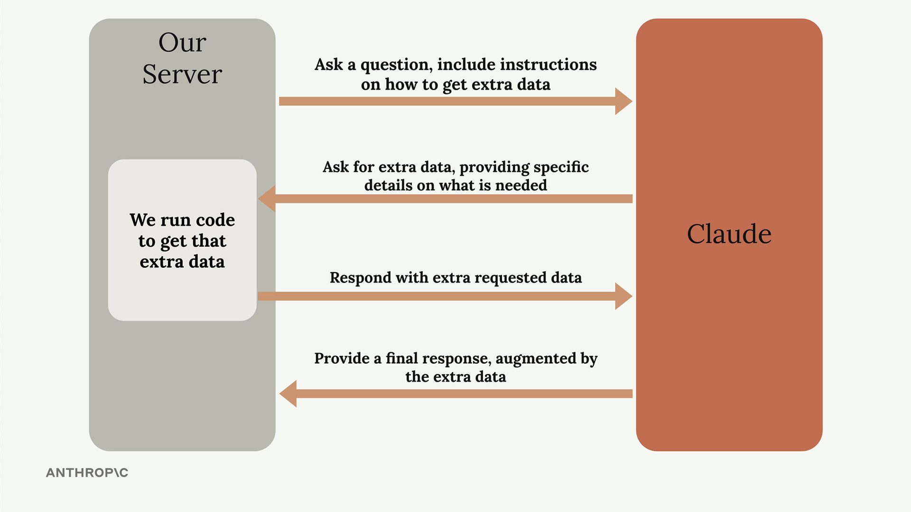
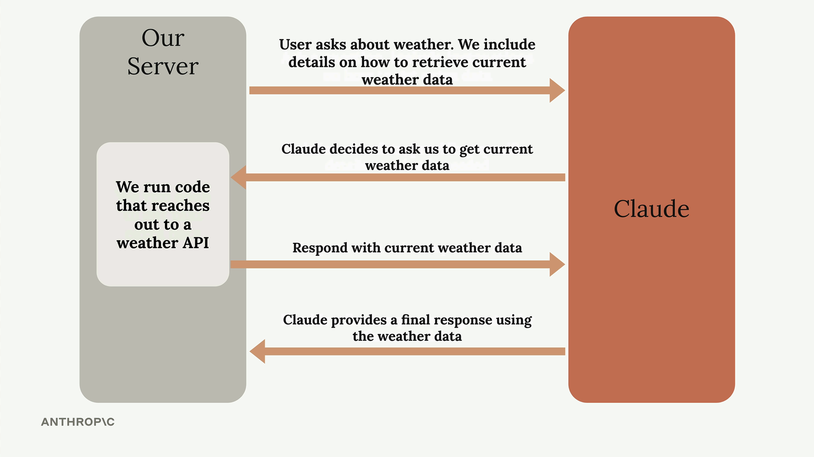
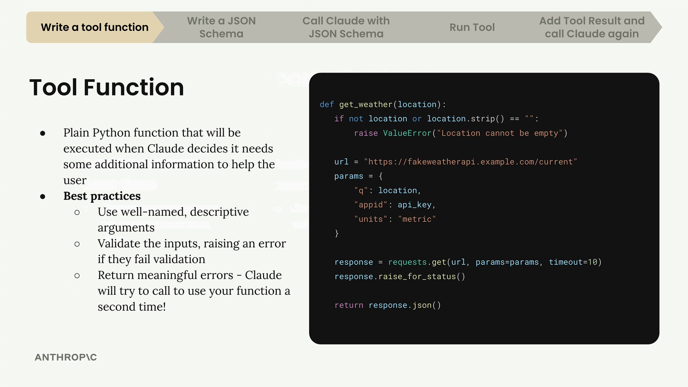
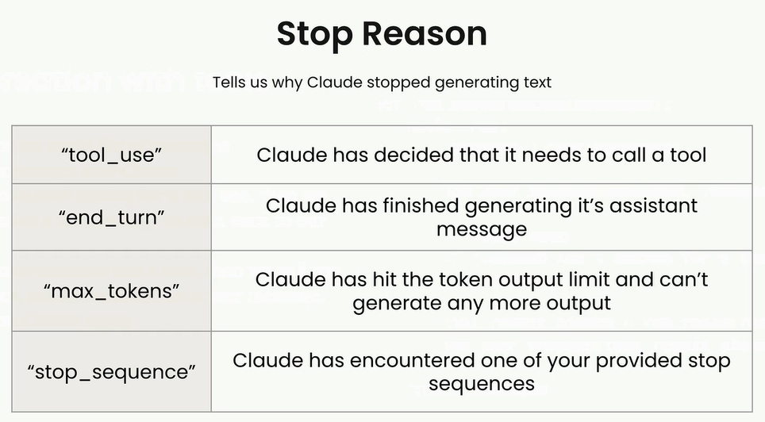
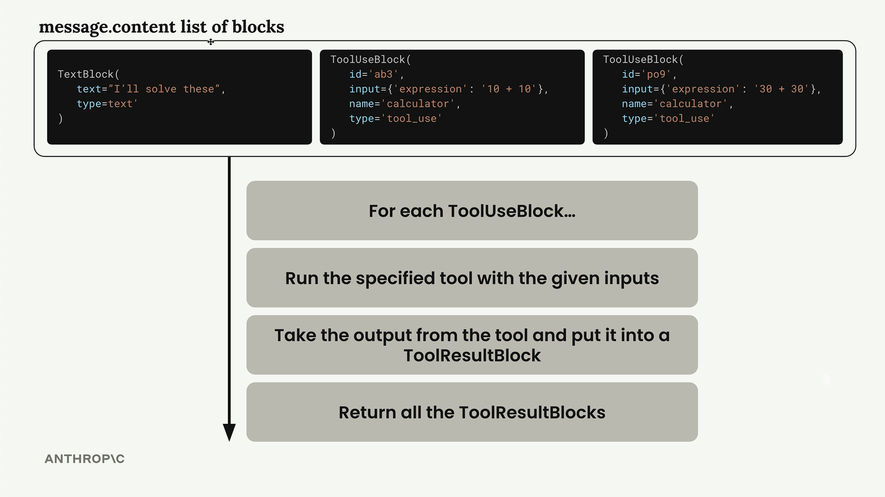
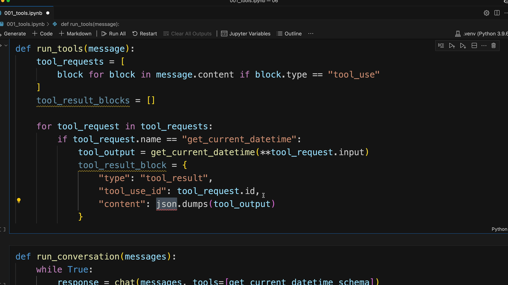

# Tool Use

## How Tool Use Works

Tool use follows a specific back-and-forth pattern between your application and Claude. Here's the complete flow:



## Weather Example in Practice

Let's see how this works with the weather question. The process becomes much more specific:



## What Are Tool Functions?

A tool function is a plain Python function that gets executed automatically when Claude decides it needs extra information to help a user. For example, if someone asks "What time is it?", Claude would call your date/time tool to get the current time.



## Best Practices for Tool Functions

When writing tool functions, follow these guidelines:

* Use descriptive names: Both your function name and parameter names should clearly indicate their purpose
* Validate inputs: Check that required parameters aren't empty or invalid, and raise errors when they are
* Provide meaningful error messages: Claude can see error messages and might retry the function call with corrected parameters

The validation is particularly important because Claude learns from errors. If you raise a clear error like "Location cannot be empty", Claude might try calling the function again with a proper location value.

# Implementing multiple turns

## Detecting Tool Requests

The key to knowing whether Claude wants to use a tool lies in the `stop_reason` field of the response message. When Claude decides it needs to call a tool, this field gets set to "tool_use". This gives us a clean way to check if we need to continue the conversation loop:

```
if response.stop_reason != "tool_use":
    break  # Claude is done, no more tools needed
```
## Stop Reasons


## The Conversation Loop

The main conversation function follows a simple pattern:

```
def run_conversation(messages):
    while True:
        response = chat(messages, tools=[get_current_datetime_schema])
        add_assistant_message(messages, response)
        print(text_from_message(response))
        
        if response.stop_reason != "tool_use":
            break
            
        tool_results = run_tools(response)
        add_user_message(messages, tool_results)
    
    return messages
```


This loop continues until Claude provides a final answer without requesting any tools.

## Handling Multiple Tool Calls

Claude can request multiple tools in a single response. The message content contains a list of blocks, and we need to process each tool use block separately:



The run_tools function handles this by filtering for tool use blocks and processing each one:

```
def run_tools(message):
    tool_requests = [
        block for block in message.content if block.type == "tool_use"
    ]
    tool_result_blocks = []
    
    for tool_request in tool_requests:
        # Process each tool request...
```

## Tool Result Blocks

Each tool use block must be answered with a corresponding tool result block. The connection between them is maintained through matching IDs:



The tool result block structure includes:

```
tool_result_block = {
    "type": "tool_result",
    "tool_use_id": tool_request.id,
    "content": json.dumps(tool_output),
    "is_error": False
}
```

## Error Handling

Robust tool execution requires handling potential errors. When a tool fails, we still need to provide a result block to Claude:

```
try:
    tool_output = run_tool(tool_request.name, tool_request.input)
    tool_result_block = {
        "type": "tool_result",
        "tool_use_id": tool_request.id,
        "content": json.dumps(tool_output),
        "is_error": False
    }
except Exception as e:
    tool_result_block = {
        "type": "tool_result", 
        "tool_use_id": tool_request.id,
        "content": f"Error: {e}",
        "is_error": True
    }
```

## Scalable Tool Routing

To support multiple tools, create a routing function that maps tool names to their implementations:

```
def run_tool(tool_name, tool_input):
    if tool_name == "get_current_datetime":
        return get_current_datetime(**tool_input)
    elif tool_name == "another_tool":
        return another_tool(**tool_input)
    # Add more tools as needed
```


This approach makes it easy to add new tools without modifying the core conversation logic.

## Complete Workflow

The complete multi-turn conversation works like this:

* Send user message to Claude with available tools
* Claude responds with text and/or tool requests
* Execute all requested tools and create result blocks
* Send tool results back as a user message
* Repeat until Claude provides a final answer

This creates a seamless experience where Claude can use multiple tools across several turns to fully answer complex user requests. The conversation history maintains the complete context, allowing Claude to build upon previous tool results to provide comprehensive responses.