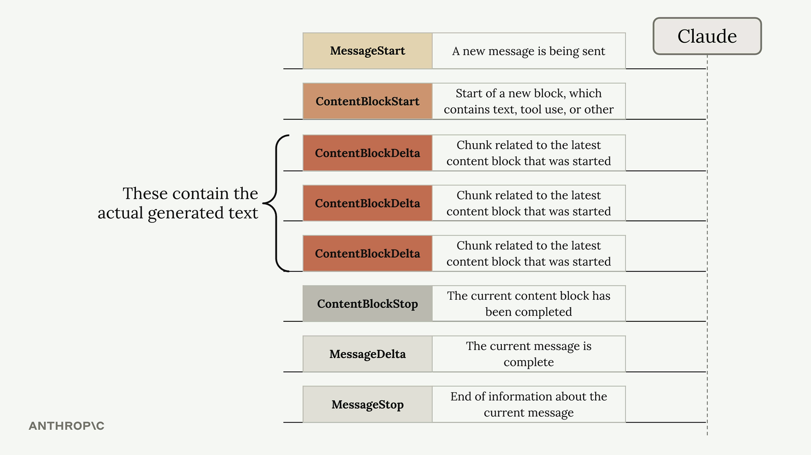
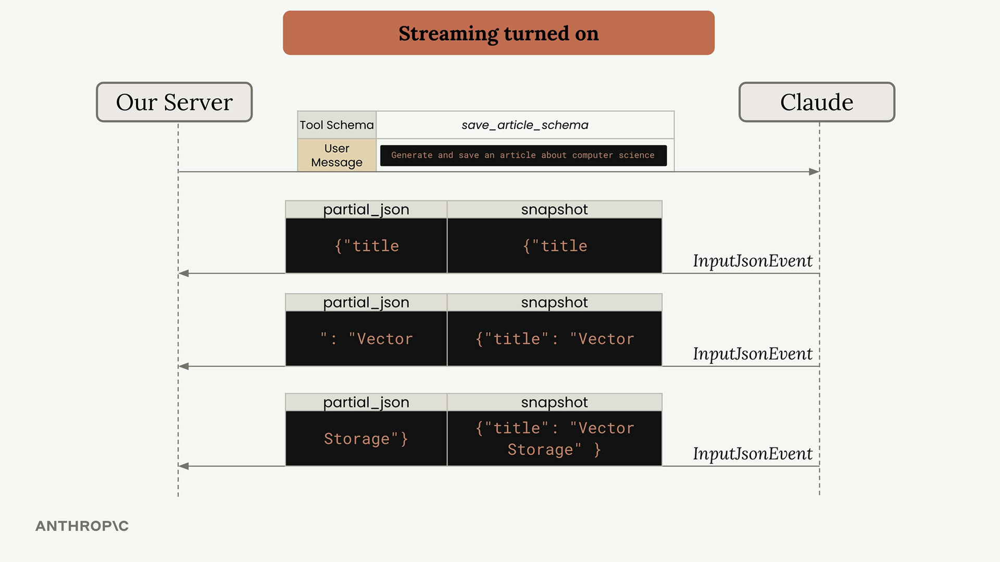
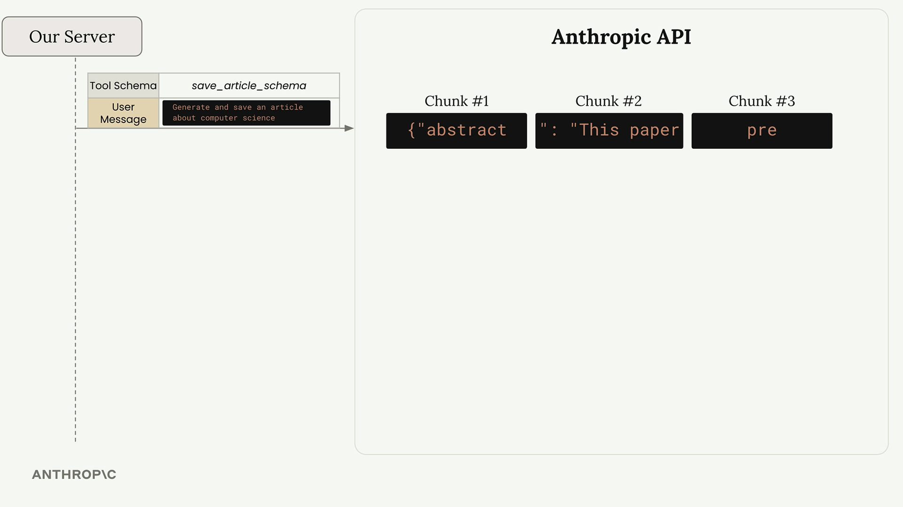
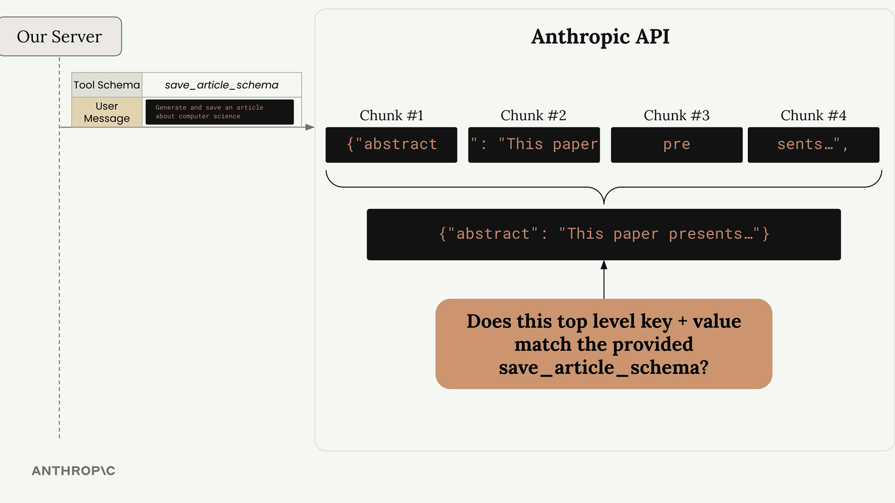
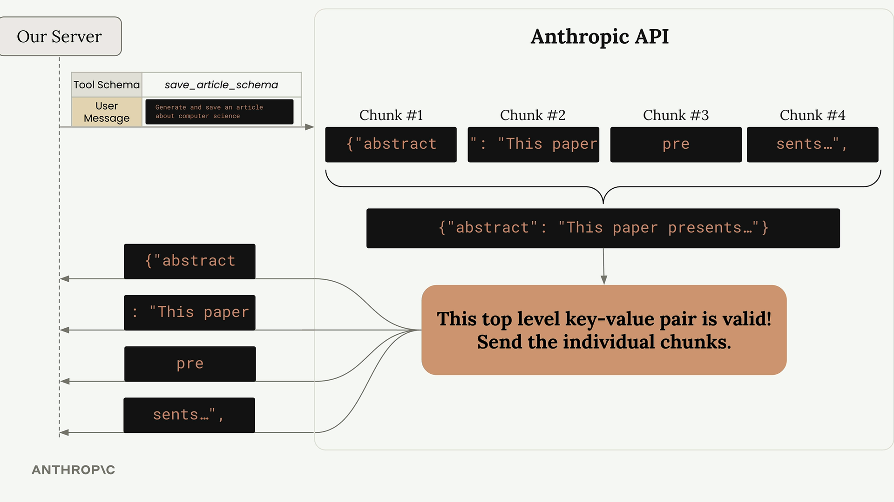
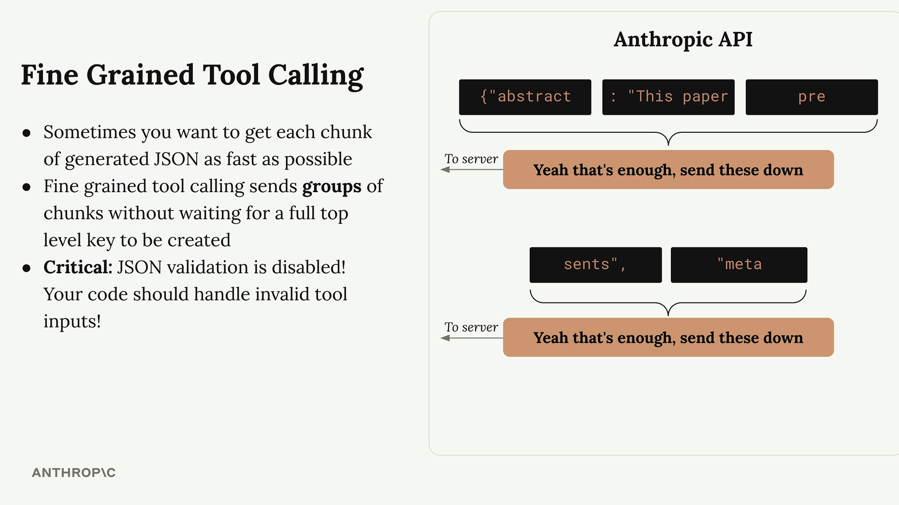
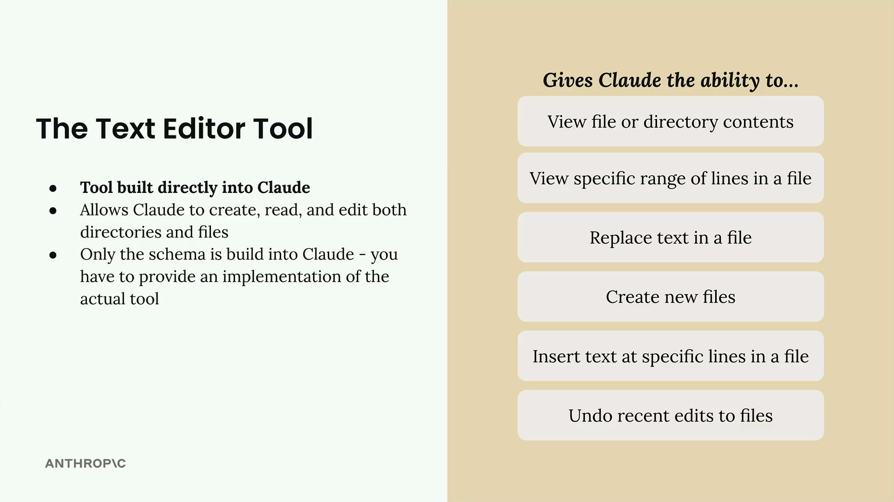

# Tool Use

## How Tool Use Works

Tool use follows a specific back-and-forth pattern between your application and Claude. Here's the complete flow:


## Weather Example in Practice

Let's see how this works with the weather question. The process becomes much more specific:


## What Are Tool Functions?

A tool function is a plain Python function that gets executed automatically when Claude decides it needs extra information to help a user. For example, if someone asks "What time is it?", Claude would call your date/time tool to get the current time.


## Best Practices for Tool Functions

When writing tool functions, follow these guidelines:

* Use descriptive names: Both your function name and parameter names should clearly indicate their purpose
* Validate inputs: Check that required parameters aren't empty or invalid, and raise errors when they are
* Provide meaningful error messages: Claude can see error messages and might retry the function call with corrected parameters

The validation is particularly important because Claude learns from errors. If you raise a clear error like "Location cannot be empty", Claude might try calling the function again with a proper location value.

# Implementing multiple turns

## Detecting Tool Requests

The key to knowing whether Claude wants to use a tool lies in the `stop_reason` field of the response message. When Claude decides it needs to call a tool, this field gets set to "tool_use". This gives us a clean way to check if we need to continue the conversation loop:

```
if response.stop_reason != "tool_use":
    break  # Claude is done, no more tools needed
```
## Stop Reasons


## The Conversation Loop

The main conversation function follows a simple pattern:

```
def run_conversation(messages):
    while True:
        response = chat(messages, tools=[get_current_datetime_schema])
        add_assistant_message(messages, response)
        print(text_from_message(response))
        
        if response.stop_reason != "tool_use":
            break
            
        tool_results = run_tools(response)
        add_user_message(messages, tool_results)
    
    return messages
```


This loop continues until Claude provides a final answer without requesting any tools.

## Handling Multiple Tool Calls

Claude can request multiple tools in a single response. The message content contains a list of blocks, and we need to process each tool use block separately:


The run_tools function handles this by filtering for tool use blocks and processing each one:

```
def run_tools(message):
    tool_requests = [
        block for block in message.content if block.type == "tool_use"
    ]
    tool_result_blocks = []
    
    for tool_request in tool_requests:
        # Process each tool request...
```

## Tool Result Blocks

Each tool use block must be answered with a corresponding tool result block. The connection between them is maintained through matching IDs:


The tool result block structure includes:

```
tool_result_block = {
    "type": "tool_result",
    "tool_use_id": tool_request.id,
    "content": json.dumps(tool_output),
    "is_error": False
}
```

## Error Handling

Robust tool execution requires handling potential errors. When a tool fails, we still need to provide a result block to Claude:

```
try:
    tool_output = run_tool(tool_request.name, tool_request.input)
    tool_result_block = {
        "type": "tool_result",
        "tool_use_id": tool_request.id,
        "content": json.dumps(tool_output),
        "is_error": False
    }
except Exception as e:
    tool_result_block = {
        "type": "tool_result", 
        "tool_use_id": tool_request.id,
        "content": f"Error: {e}",
        "is_error": True
    }
```

## Scalable Tool Routing

To support multiple tools, create a routing function that maps tool names to their implementations:

```
def run_tool(tool_name, tool_input):
    if tool_name == "get_current_datetime":
        return get_current_datetime(**tool_input)
    elif tool_name == "another_tool":
        return another_tool(**tool_input)
    # Add more tools as needed
```


This approach makes it easy to add new tools without modifying the core conversation logic.

## Complete Workflow

The complete multi-turn conversation works like this:

* Send user message to Claude with available tools
* Claude responds with text and/or tool requests
* Execute all requested tools and create result blocks
* Send tool results back as a user message
* Repeat until Claude provides a final answer

This creates a seamless experience where Claude can use multiple tools across several turns to fully answer complex user requests. The conversation history maintains the complete context, allowing Claude to build upon previous tool results to provide comprehensive responses.

# Fine grained tool calling

## Basic Tool Streaming

With streaming enabled, Claude sends back different types of events as it processes your request. You're already familiar with events like `ContentBlockDelta` for regular text generation. For tool use, you'll also need to handle a new event type called `InputJsonEvent`.



Each InputJsonEvent contains two key properties:

* **partial_json** - A chunk of JSON representing part of the tool arguments
* **snapshot** - The cumulative JSON built up from all chunks received so far

Here's how you handle these events in your streaming pipeline:

```
for chunk in stream:
    if chunk.type == "input_json":
        # Process the partial JSON chunk
        print(chunk.partial_json)
        # Or use the complete snapshot so far
        current_args = chunk.snapshot
```



## How JSON Validation Works

Here's where things get interesting. The Anthropic API doesn't immediately send you every chunk as Claude generates it. Instead, it buffers chunks and validates them first.



The API waits for complete top-level key-value pairs before sending anything. For example, if your tool expects this structure:

```
{
  "abstract": "This paper presents a novel...",
  "meta": {
    "word_count": 847,
    "review": "This paper introduces QuanNet..."
  }
}
```

The API will:

1. Wait until the entire abstract value is complete
2. Validate that key-value pair against your schema
3. Send all the buffered chunks for abstract at once
4. Repeat the process for the meta object



This validation process explains why you see delays followed by bursts of text, even with streaming enabled. The chunks are being held back until a complete, valid top-level key-value pair is ready.



## Fine-Grained Tool Calling

If you need faster, more granular streaming - perhaps to show users immediate updates or start processing partial results quickly - you can enable fine-grained tool calling.



Fine-grained tool calling does one main thing: it disables JSON validation on the API side. This means:

You get chunks as soon as Claude generates them
No buffering delays between top-level keys
More traditional streaming behavior
Critical: JSON validation is disabled - your code must handle invalid JSON

Enable it by adding fine_grained=True to your API call:

```
run_conversation(
    messages, 
    tools=[save_article_schema], 
    fine_grained=True
)
```

With fine-grained tool calling, you might receive a word_count value much earlier in the stream, without waiting for the entire meta object to be completed.

## Handling Invalid JSON

When using fine-grained tool calling, Claude might generate invalid JSON like `"word_count": undefined` instead of a proper number. Your application needs to handle these cases gracefully:

```
try:
    parsed_args = json.loads(chunk.snapshot)
except json.JSONDecodeError:
    # Handle invalid JSON appropriately
    print("Received invalid JSON, continuing...")
```

Without fine-grained tool calling, the API's validation would catch this error and potentially wrap problematic values in strings, which might not match your expected schema.

## When to Use Fine-Grained Tool Calling

Consider enabling fine-grained tool calling when:

* You need to show users real-time progress on tool argument generation
* You want to start processing partial tool results as quickly as possible
* The buffering delays negatively impact your user experience
* You're comfortable implementing robust JSON error handling

For most applications, the default behavior with validation is perfectly adequate. But when you need that extra responsiveness, fine-grained tool calling gives you the control to get chunks as fast as Claude can generate them.

# The text edit tool

**Important Note:** Tool version strings can for all model versions can be found here: https://docs.anthropic.com/en/docs/agents-and-tools/tool-use/text-editor-tool

Claude comes with one built-in tool that you don't need to create from scratch: the text editor tool. This tool gives Claude the ability to work with files and directories just like you would in a standard text editor.


## What the Text Editor Tool Can Do

The text editor tool provides Claude with a comprehensive set of file manipulation capabilities:

* View file or directory contents
* View specific ranges of lines in a file
* Replace text in a file
* Create new files
* Insert text at specific lines in a file
* Undo recent edits to files



This dramatically expands Claude's abilities and essentially gives it the power to act as a software engineer right out of the gate.

## Understanding the Implementation Requirements

Here's where things get a bit confusing: while the tool schema is built into Claude, you still need to provide the actual implementation. Think of it this way - Claude knows how to ask for file operations, but you need to write the code that actually performs those operations.

When you use other tools, you write both the JSON schema and the function implementation. With the text editor tool, Claude provides the schema knowledge, but you must write functions to handle Claude's requests to create files, read directories, replace text, and so on.

## Schema Versions

While the main schema is built into Claude, you do need to include a small schema stub when making requests. The exact schema depends on which Claude model you're using:

```
def get_text_edit_schema(model):
    if model.startswith("claude-3-7-sonnet"):
        return {
            "type": "text_editor_20250124",
            "name": "str_replace_editor",
        }
    elif model.startswith("claude-3-5-sonnet"):
        return {
            "type": "text_editor_20241022", 
            "name": "str_replace_editor",
        }
```

Claude sees this small schema and automatically expands it into the full text editor tool specification behind the scenes.
Practical Example

Let's see the text editor tool in action. When you ask Claude to work with files, it will use the tool to read, modify, and create files as needed.

For example, if you ask Claude to "Open the ./main.py file and summarize its contents", Claude will:

* Use the text editor tool to view the file
* Read the contents
* Provide you with a summary

You can take this further by asking Claude to modify files. For instance: "Open the ./main.py file and write out a function to calculate pi to the 5th digit. Then create a ./test.py file to test your implementation."

Claude will:

1. View the existing main.py file
2. Replace its contents with a new implementation including the.pi calculation function
3. Create a new test.py file with appropriate unit tests

## Why Use the Text Editor Tool?

You might wonder why this tool exists when modern code editors already have AI assistants built in. The text editor tool becomes valuable in scenarios where:

* You're building applications that need to programmatically edit files
* You're working in environments without access to full-featured code editors
* You want to integrate file editing capabilities directly into your Claude-powered applications

Essentially, the text editor tool lets you replicate much of the functionality of a fancy AI-powered code editor within your own applications, giving you fine-grained control over how Claude interacts with your file system.