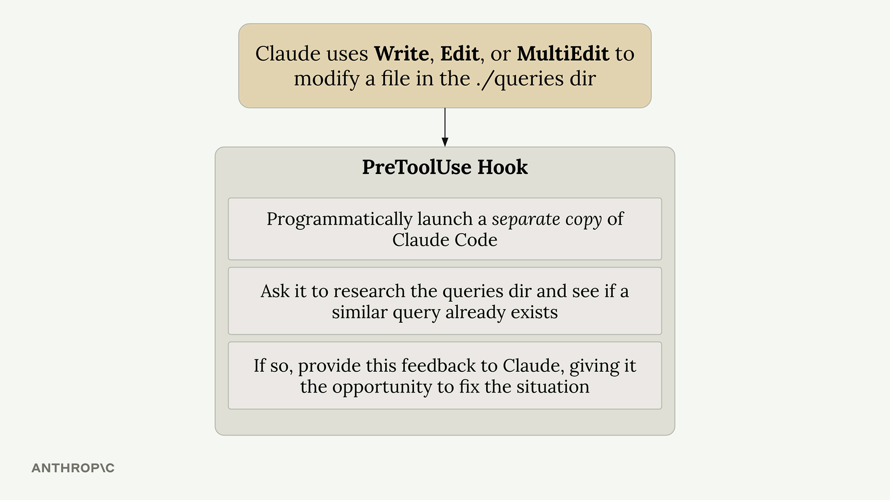

# Hooks

They are used to run commands before or after Claude Code does something. Optionally blocks Claude action

* PreToolUse
* PostToolUse

### Hook Configuration

Hooks are defined in Claude settings files. You can add them to:
```yaml
* Global - ~/.claude/settings.json (affects all projects)
* Project - .claude/settings.json (shared with team)
* Project (not committed) - .claude/settings.local.json (personal settings)
```
You can write hooks by hand in these files or use the /hooks command inside Claude Code.


### PreToolUse Hooks

PreToolUse hooks run before a tool is executed. They include a matcher that specifies which tool types to target:

```
"PreToolUse": [
  {
    "matcher": "Read",
    "hooks": [
      {
        "type": "command",
        "command": "node /home/hooks/read_hook.js"
      }
    ]
  }
]
```

Before the 'Read' tool is executed, this configuration runs the specified command. Your command receives details about the tool call Claude wants to make, and you can:

    Allow the operation to proceed normally
    Block the tool call and send an error message back to Claude

### PostToolUse Hooks

PostToolUse hooks run after a tool has been executed. Here's an example that triggers after write, edit, or multi-edit operations:

```
"PostToolUse": [
  {
    "matcher": "Write|Edit",
    "hooks": [
      {
        "type": "command", 
        "command": "node /home/hooks/edit_hook.js"
      }
    ]
  }
]
```

Since the tool call has already occurred, PostToolUse hooks can't block the operation. However, they can:

    Run follow-up operations (like formatting a file that was just edited)
    Provide additional feedback to Claude about the tool use


### Practical Applications

Here are some common ways to use hooks:

    Code formatting - Automatically format files after Claude edits them
    Testing - Run tests automatically when files are changed
    Access control - Block Claude from reading or editing specific files
    Code quality - Run linters or type checkers and provide feedback to Claude
    Logging - Track what files Claude accesses or modifies
    Validation - Check naming conventions or coding standards

The key insight is that hooks let you extend Claude Code's capabilities by integrating your own tools and processes into the workflow. PreToolUse hooks give you control over what Claude can do, while PostToolUse hooks let you enhance what Claude has done.

## Available Tools


### Tools Call Structure


```
{
  "session_id": "2d6a1e4d-6...",
  "transcript_path": "/Users/sg/...",
  "hook_event_name": "PreToolUse",
  "tool_name": "Read",
  "tool_input": {
    "file_path": "/code/queries/.env"
  }
}
```

### Exit Codes and Control Flow

Your hook command communicates back to Claude through exit codes:

* Exit Code 0 - Everything is fine, allow the tool call to proceed
* Exit Code 2 - Block the tool call (PreToolUse hooks only)

### Example Use Case

A common use case is preventing Claude from reading sensitive files like .env files. Since both the Read and Grep tools can access file contents, you'd want to monitor both tool types and check if they're trying to access restricted file paths.

This approach gives you complete control over Claude's file system access while providing clear feedback about why certain operations are restricted.

## Implementing a hook

Let's build a hook that prevents Claude from reading sensitive files. This is a practical example of how a PreToolUse hook can intercept tool calls before they run.

### What this exercise covers

You'll write a hook that blocks the Read tool from opening .env. This protects your environment variables during a session.

Note that this hook covers Read only. Blocking Grep or Bash from reaching the same file requires checking each tool's input shape separately, since each tool sends different fields. For comprehensive file protection, combine a hook with a permissions.deny rule like "Read(**/.env)". See the hooks guide for a fuller treatment.

### Configure the hook

Open .claude/settings.local.json and add a PreToolUse hook that matches the Read tool:

```
{
  "hooks": {
    "PreToolUse": [
      {
        "matcher": "Read",
        "hooks": [
          { "type": "command", "command": "node $PWD/hooks/read_hook.js" }
        ]
      }
    ]
  }
}
```

### Write the hook script

Create hooks/read_hook.js:

```
process.stdin.setEncoding("utf8");
let input = "";
process.stdin.on("data", (d) => (input += d));
process.stdin.on("end", () => {
  const toolArgs = JSON.parse(input);
  const readPath = toolArgs.tool_input?.file_path || "";
  if (readPath.includes(".env")) {
    console.error("You cannot read the .env file");
    process.exit(2);
  }
  process.exit(0);
});
```

The hook reads the tool call from stdin as JSON, checks tool_input.file_path, and exits with code 2 to block the call (anything written to stderr becomes the message Claude sees).

### Test it

In a Claude Code session, ask Claude to read your .env file. You should see:

```
You cannot read the .env file
```

That's the hook blocking the Read call. Ask Claude to read a different file and it works normally.
Why Read only?

Each tool sends a different input shape. Read sends {"file_path": "..."}; Grep sends {"pattern": "...", "path": "..."} where path is a search directory, not a file; Bash sends {"command": "..."}. A check on file_path catches Read but won't catch a project-wide grep for API_KEY or a cat .env in Bash. To cover those, you'd write separate matchers per tool and inspect each one's specific fields — or use permissions.deny rules, which apply uniformly across tools.

## Gotchas

You may notice that after running the npm run setup command there are two `settings.json` files in the `.claude` directory. Let me explain what's going on there.

The Claude Code documentation lists some recommendations around hooks security:


One of the recommendations is to use absolute paths (rather than relative paths) for scripts. This helps mitigate path interception and binary planting attacks.

This recommendation also makes it much more challenging to share `settings.json` files. The reason is simple: the absolute path to any of the hook scripts on your machine will likely be different from the absolute path on my machine, simply because we will probably place the project in separate directories. 

To solve this problem, our project has a `settings.example.json` file. Inside of it, the script references contain a `$PWD` placeholder. When we run npm run setup, some dependencies are installed, but it also runs an `init-claude.js` script placed inside the scripts directory. This script will replace those $PWD placeholder with the absolute path to the project on your machine, copy the `settings.example.json` file, and rename it to `settings.local.json`.

This script allows us to share `settings.json` files but still use the recommended absolute paths! 

## Examples

### Another useful hook

There are more hooks beyond the PreToolUse and PostToolUse hooks discussed in this course. There are also:

    Notification - Runs when Claude Code sends a notification, which occurs when Claude needs permission to use a tool, or after Claude Code has been idle for 60 seconds
    Stop - Runs when Claude Code has finished responding
    SubagentStop - Runs when a subagent (these are displayed as a "Task" in the UI) has finished
    PreCompact - Runs before a compact operation occurs, either manual or automatic
    UserPromptSubmit - Runs when the user submits a prompt, before Claude processes it
    SessionStart - Runs when starting or resuming a session
    SessionEnd - Runs when a session ends

Here's the confusing part:

    The stdin input to your commands will change based upon the type of hook being executed (PreToolUse, PostToolUse, Notification, etc)
    The tool_input contained in that will differ based upon the tool that was called (in the case of PreToolUse and PostToolUse hooks)

For example, here's a sample of some stdin input to a hook, where the hook is a PostToolUse that was watching for uses of the TodoWrite tool. For reference, that is the tool that Claude uses to keep track of to-do items.

```
{
  "session_id": "9ecf22fa-edf8-4332-ae85-b6d5456eda64",
  "transcript_path": "<path_to_transcript>",
  "hook_event_name": "PostToolUse",
  "tool_name": "TodoWrite",
  "tool_input": {
    "todos": [{ "content": "write a readme", "status": "pending", "id": "1" }]
  },
  "tool_response": {
    "oldTodos": [],
    "newTodos": [{ "content": "write a readme", "status": "pending", "id": "1" }]
  }
}
```

And for comparison, here's an example of the input to a Stop hook:

```
{
  "session_id": "af9f50b6-f042-4773-b3e2-c3a4814765ce",
  "transcript_path": "<path_to_transcript>",
  "hook_event_name": "Stop",
  "stop_hook_active": false
}
```

As you can see, the stdin input to your command will differ significantly based upon the hook (PreToolUse, PostToolUse, Stop, etc) and the matcher used (in the case of PreToolUse and PostToolUse). This can make writing hooks challenging - you might not know the exact structure of the input to your command!

To handle this challenge, try making a helper hook like this:

```
"PostToolUse": [ // Or "PreToolUse" or "Stop", etc
  {
    "matcher": "*",
    "hooks": [
      {
        "type": "command",
        "command": "jq . > post-log.json"
      }
    ]
  },
]
```

Notice the provided command. It will write the input to this hook to the post-log.json file, which allows you to inspect exactly what would have been fed into your command! This makes it a lot easier for you to understand what data your command should inspect.


### TypeScript Type Checking Hook

One of the most useful hooks addresses a fundamental problem: when Claude modifies a function signature, it often doesn't update all the places where that function is called throughout your project.

For example, if you ask Claude to add a verbose parameter to a function in schema.ts, it will successfully update the function definition but miss the call site in main.ts. This creates type errors that Claude doesn't immediately catch.

The solution is a post-tool-use hook that runs the TypeScript compiler after every file edit:

    Runs tsc --noEmit to check for type errors
    Captures any errors found
    Feeds the errors back to Claude immediately
    Prompts Claude to fix the issues in other files

This hook works for any typed language where you can run a type checker. For untyped languages, you could implement similar functionality using automated tests instead.

### Query Duplication Prevention Hook

In larger projects with many database queries, Claude sometimes creates duplicate functionality instead of reusing existing code. This is especially problematic when you give Claude complex, multi-step tasks that include database operations as just one component.

 

Consider a project structure with multiple query files, each containing many SQL functions. When you ask Claude to "create a Slack integration that alerts about orders pending longer than 3 days," it might write a new query instead of using the existing getPendingOrders() function.

The query duplication hook addresses this by implementing a review process:



Here's how it works:

    Triggers when Claude modifies files in the ./queries directory
    Launches a separate instance of Claude Code programmatically
    Asks the second instance to review the changes and check for similar existing queries
    If duplicates are found, provides feedback to the original Claude instance
    Prompts Claude to remove the duplicate and use the existing functionality

Implementation Considerations

Both hooks use the pre-tool-use or post-tool-use hook system. The TypeScript hook is relatively lightweight and runs quickly. The query duplication hook requires more resources since it launches a separate Claude instance for each review.

For the query hook, consider these trade-offs:

    Benefits: Cleaner codebase with less duplication
    Costs: Additional time and API usage for each query directory edit
    Recommendation: Only monitor critical directories to minimize overhead

The hooks use Claude's Agent SDK to programmatically interact with the AI. This allows you to create sophisticated workflows where one Claude instance can review and provide feedback on another's work.
Extending These Concepts

These hooks demonstrate broader principles you can apply to your own projects:

    Use compiler/linter output to provide immediate feedback
    Implement code review processes using separate AI instances
    Focus monitoring on high-value directories where consistency matters most
    Balance automation benefits against performance costs

The key is identifying the specific pain points in your development workflow and creating targeted hooks that address those issues automatically.