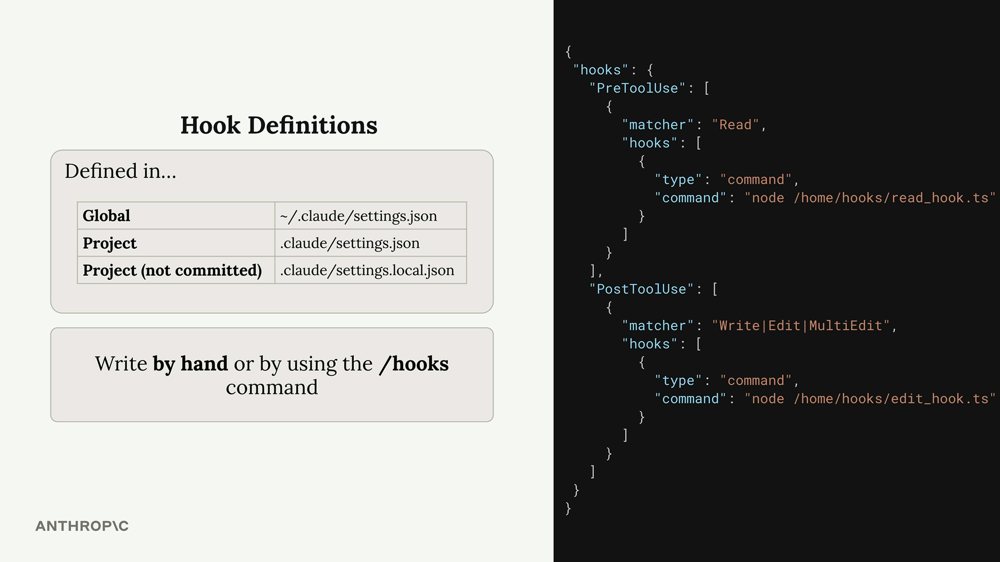
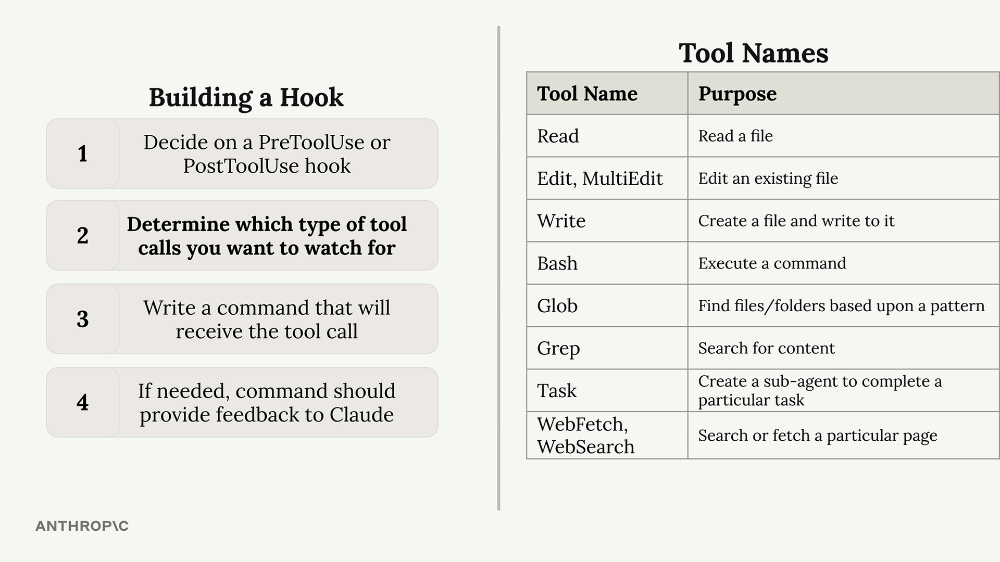
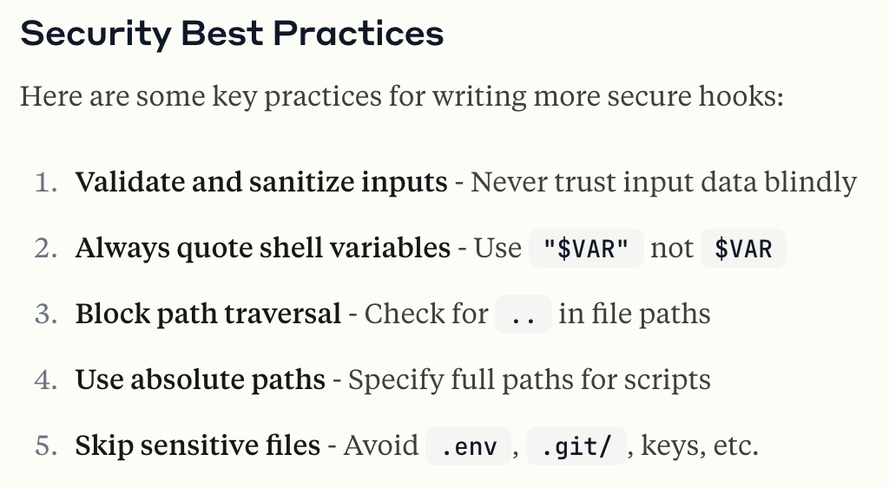

# Hooks

They are used to run commands before or after Claude Code does something. Optionally blocks Claude action

* PreToolUse
* PostToolUse

### Hook Configuration

Hooks are defined in Claude settings files. You can add them to:
```yaml
* Global - ~/.claude/settings.json (affects all projects)
* Project - .claude/settings.json (shared with team)
* Project (not committed) - .claude/settings.local.json (personal settings)
```
You can write hooks by hand in these files or use the /hooks command inside Claude Code.



### PreToolUse Hooks

PreToolUse hooks run before a tool is executed. They include a matcher that specifies which tool types to target:

```
"PreToolUse": [
  {
    "matcher": "Read",
    "hooks": [
      {
        "type": "command",
        "command": "node /home/hooks/read_hook.js"
      }
    ]
  }
]
```

Before the 'Read' tool is executed, this configuration runs the specified command. Your command receives details about the tool call Claude wants to make, and you can:

    Allow the operation to proceed normally
    Block the tool call and send an error message back to Claude

### PostToolUse Hooks

PostToolUse hooks run after a tool has been executed. Here's an example that triggers after write, edit, or multi-edit operations:

```
"PostToolUse": [
  {
    "matcher": "Write|Edit",
    "hooks": [
      {
        "type": "command", 
        "command": "node /home/hooks/edit_hook.js"
      }
    ]
  }
]
```

Since the tool call has already occurred, PostToolUse hooks can't block the operation. However, they can:

    Run follow-up operations (like formatting a file that was just edited)
    Provide additional feedback to Claude about the tool use


### Practical Applications

Here are some common ways to use hooks:

    Code formatting - Automatically format files after Claude edits them
    Testing - Run tests automatically when files are changed
    Access control - Block Claude from reading or editing specific files
    Code quality - Run linters or type checkers and provide feedback to Claude
    Logging - Track what files Claude accesses or modifies
    Validation - Check naming conventions or coding standards

The key insight is that hooks let you extend Claude Code's capabilities by integrating your own tools and processes into the workflow. PreToolUse hooks give you control over what Claude can do, while PostToolUse hooks let you enhance what Claude has done.

## Available Tools



### Tools Call Structure



```
{
  "session_id": "2d6a1e4d-6...",
  "transcript_path": "/Users/sg/...",
  "hook_event_name": "PreToolUse",
  "tool_name": "Read",
  "tool_input": {
    "file_path": "/code/queries/.env"
  }
}
```

### Exit Codes and Control Flow

Your hook command communicates back to Claude through exit codes:

* Exit Code 0 - Everything is fine, allow the tool call to proceed
* Exit Code 2 - Block the tool call (PreToolUse hooks only)

### Example Use Case

A common use case is preventing Claude from reading sensitive files like .env files. Since both the Read and Grep tools can access file contents, you'd want to monitor both tool types and check if they're trying to access restricted file paths.

This approach gives you complete control over Claude's file system access while providing clear feedback about why certain operations are restricted.

## Implementing a hook

Let's build a hook that prevents Claude from reading sensitive files. This is a practical example of how a PreToolUse hook can intercept tool calls before they run.

### What this exercise covers

You'll write a hook that blocks the Read tool from opening .env. This protects your environment variables during a session.

Note that this hook covers Read only. Blocking Grep or Bash from reaching the same file requires checking each tool's input shape separately, since each tool sends different fields. For comprehensive file protection, combine a hook with a permissions.deny rule like "Read(**/.env)". See the hooks guide for a fuller treatment.

### Configure the hook

Open .claude/settings.local.json and add a PreToolUse hook that matches the Read tool:

```
{
  "hooks": {
    "PreToolUse": [
      {
        "matcher": "Read",
        "hooks": [
          { "type": "command", "command": "node $PWD/hooks/read_hook.js" }
        ]
      }
    ]
  }
}
```

### Write the hook script

Create hooks/read_hook.js:

```
process.stdin.setEncoding("utf8");
let input = "";
process.stdin.on("data", (d) => (input += d));
process.stdin.on("end", () => {
  const toolArgs = JSON.parse(input);
  const readPath = toolArgs.tool_input?.file_path || "";
  if (readPath.includes(".env")) {
    console.error("You cannot read the .env file");
    process.exit(2);
  }
  process.exit(0);
});
```

The hook reads the tool call from stdin as JSON, checks tool_input.file_path, and exits with code 2 to block the call (anything written to stderr becomes the message Claude sees).

### Test it

In a Claude Code session, ask Claude to read your .env file. You should see:

```
You cannot read the .env file
```

That's the hook blocking the Read call. Ask Claude to read a different file and it works normally.
Why Read only?

Each tool sends a different input shape. Read sends {"file_path": "..."}; Grep sends {"pattern": "...", "path": "..."} where path is a search directory, not a file; Bash sends {"command": "..."}. A check on file_path catches Read but won't catch a project-wide grep for API_KEY or a cat .env in Bash. To cover those, you'd write separate matchers per tool and inspect each one's specific fields — or use permissions.deny rules, which apply uniformly across tools.